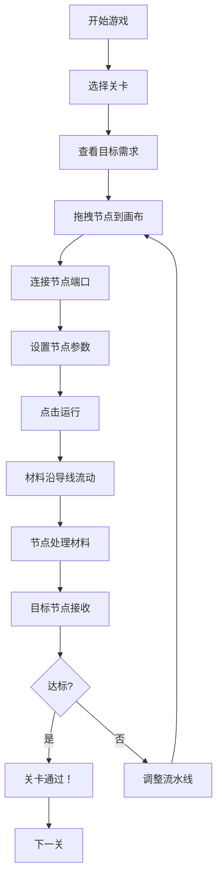

## 1. 产品概述

节点工厂：一款基于 Zachtronics 风格的可视化编程解谜游戏。玩家通过拖拽放置加工节点、连接导线，构建数据流向图（DAG），将原始材料转化为目标形状。

- 核心玩法：拖拽节点 → 连线构建流水线 → 运行模拟 → 验证结果
- 目标用户：编程爱好者、解谜游戏玩家、教育场景学习者
- 价值：直观理解数据流、有向无环图（DAG）执行、可视化编程概念

## 2. 核心功能

### 2.1 功能模块
1. **游戏主界面**：节点工具栏、主画布、原料出口区、目标需求区、控制面板
2. **节点系统**：原料出口、切割机、染色机、拼接机、目标节点
3. **连线系统**：贝塞尔曲线导线、端口连接校验、路径可视化
4. **执行引擎**：DAG 拓扑排序、时间步（Tick）执行、数据流动画
5. **关卡系统**：多关卡递进、目标要求展示、成功/失败判定

### 2.2 页面详情

| 页面名称 | 模块名称 | 功能描述 |
|---------|---------|---------|
| 游戏主界面 | 节点工具栏 | 可拖拽的节点类型列表（出口/切割/染色/拼接/目标） |
| 游戏主界面 | 主画布 | 节点放置、拖拽移动、连线绘制区域 |
| 游戏主界面 | 原料出口区 | 左侧固定位置，按节奏产生原始材料图标 |
| 游戏主界面 | 目标需求区 | 右侧固定位置，展示目标形状和颜色要求 |
| 游戏主界面 | 控制面板 | 运行/暂停/重置按钮、关卡切换、状态提示 |
| 游戏主界面 | 节点属性面板 | 点击节点显示参数（如染色机的颜色选择） |

## 3. 核心流程

玩家从工具栏拖拽加工节点到画布，从出口节点的输出端口拖拽导线到下一个节点的输入端口，依次连接形成流水线。点击"运行"后，材料图标从出口流出，沿贝塞尔曲线移动，经过各节点处理（切割、染色、拼接），最终流入目标节点进行验证。

## 4. 用户界面设计

### 4.1 设计风格
- **工业复古风**：深色背景 + 金属质感 + 霓虹色调，致敬 Zachtronics 的电路美学
- **主色调**：深蓝灰 `#1a1d2e` 背景、琥珀金 `#f5a623` 高亮、青色 `#4fc3f7` 数据流
- **节点风格**：圆角矩形 + 金属边框 + 发光端口，按类型用不同颜色区分
- **字体**：JetBrains Mono（等宽代码字体）营造工程感
- **动效**：导线发光脉冲、材料粒子拖尾、节点处理时的震动反馈

### 4.2 页面设计概览

| 模块 | UI 元素 | 细节设计 |
|------|---------|---------|
| 节点工具栏 | 垂直排列的节点卡片 | 悬浮放大，拖拽时半透明跟随鼠标 |
| 主画布 | 深色网格背景 | 点状网格，节点吸附对齐，选区高亮 |
| 导线 | 三次贝塞尔曲线 | 渐变描边 + 发光，流动时显示沿路径运动的粒子 |
| 材料图标 | SVG 几何形状 | 圆形/半圆/拼接形状，填充对应颜色，带阴影 |
| 控制面板 | 工具栏按钮组 | 金属质感按钮，运行时闪烁指示灯 |

### 4.3 响应式
- 桌面端优先（1200px+），画布区域自适应
- 节点工具栏支持左右布局切换
- 移动端降级为只读预览模式
