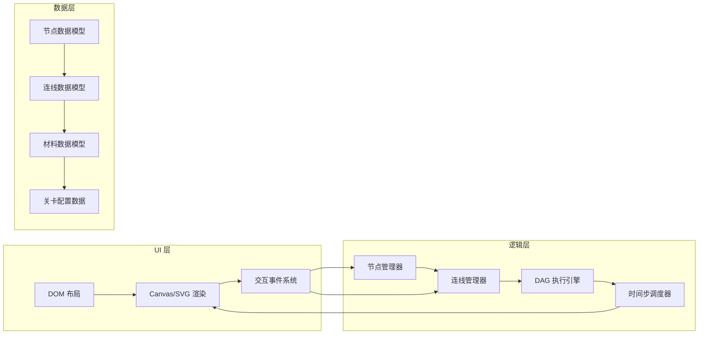

## 1. 架构设计



## 2. 技术选型

- **前端框架**：原生 HTML + CSS + JavaScript（无构建依赖，直接运行）
- **渲染技术**：SVG（节点与导线）+ Canvas（数据流动画叠加层）
- **字体**：JetBrains Mono（Google Fonts CDN）
- **无后端**：纯前端，所有逻辑在浏览器端执行
- **存储**：localStorage 保存关卡进度

## 3. 模块划分

| 模块文件 | 职责 |
|---------|------|
| `index.html` | 页面骨架：工具栏、画布、控制面板、属性面板 |
| `styles.css` | 工业复古风主题、节点样式、导线动效、响应式布局 |
| `game.js` | 游戏主入口、初始化、全局状态管理 |
| `nodes.js` | 节点类型定义、节点工厂、节点渲染与参数配置 |
| `connections.js` | 连线系统：贝塞尔曲线生成、端口连接校验、连线渲染 |
| `engine.js` | DAG 拓扑排序、时间步执行引擎、材料流转逻辑 |
| `animation.js` | 贝塞尔曲线路径计算、材料移动动画、粒子特效 |
| `levels.js` | 关卡配置、目标校验、关卡进度管理 |

## 4. 核心数据模型

### 4.1 节点模型

```javascript
Node {
  id: string,              // 唯一标识
  type: 'source'|'cutter'|'painter'|'joiner'|'target',
  x: number, y: number,    // 画布坐标
  inputs: Port[],          // 输入端口列表
  outputs: Port[],         // 输出端口列表
  params: object,          // 节点参数（如颜色）
  processing: boolean,     // 是否正在处理
  buffer: Material[]       // 内部缓冲材料
}

Port {
  id: string,
  nodeId: string,
  type: 'in'|'out',
  index: number,
  x: number, y: number     // 相对节点的位置
}
```

### 4.2 连线模型

```javascript
Connection {
  id: string,
  from: { nodeId, portIndex },  // 源端口
  to: { nodeId, portIndex },    // 目标端口
  path: BezierPath,             // 贝塞尔曲线路径数据
  materials: FlowingMaterial[]  // 正在沿此线流动的材料
}
```

### 4.3 材料模型

```javascript
Material {
  id: string,
  shape: 'circle'|'semicircle'|'composite',
  color: 'red'|'blue'|'yellow'|'green'|'purple',
  rotation: number,         // 半圆方向（0=上, 1=右, 2=下, 3=左）
  parts: MaterialPart[],    // 拼接形状的组成部分
  parentId?: string         // 来源标识（切割后的子材料）
}

FlowingMaterial {
  material: Material,
  connectionId: string,
  progress: 0..1,           // 沿路径的进度
  speed: number             // 每 tick 前进距离
}
```

### 4.4 执行调度

```
每个 Tick (60ms) 的执行顺序：
1. 拓扑排序获取节点执行顺序
2. Source 节点：产出新材料到 output buffer
3. 普通节点：
   a. 从输入连线末端接收到达的材料 → input buffer
   b. 处理 input buffer → output buffer
   c. 将 output buffer 中的材料派发到输出连线起点
4. Target 节点：接收材料并与目标对比
5. 动画更新：所有 FlowingMaterial 的 progress += speed
```

## 5. 关键算法

### 5.1 DAG 拓扑排序
- Kahn 算法：计算入度 → 移除入度为 0 的节点 → 重复直到空
- 检测环：若队列空但仍有剩余节点则报错（禁止循环连线）

### 5.2 三次贝塞尔曲线生成
```
控制点计算：
dx = |x2 - x1| * 0.5
cp1 = (x1 + dx, y1)
cp2 = (x2 - dx, y2)
```

### 5.3 沿贝塞尔曲线的匀速运动
- 预计算曲线上 N 个采样点的累积弧长表
- 按总长度和速度换算每 tick 的进度增量
- 通过弧长表二分查找当前 t 值，获取精确坐标
